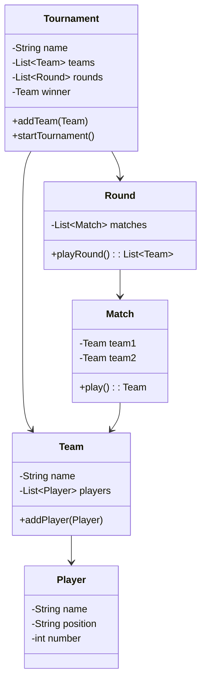

# 🏆 Java Tournament Simulator

Ever wondered which country would dominate in a randomized knockout tournament? 🇧🇷 vs 🇩🇪? 🇨🇦 vs 🇯🇵?  
This Java console app simulates just that — with auto-generated teams, unpredictable match outcomes, and pure OOP goodness.

Teams and players are generated using the [Java Faker](https://github.com/DiUS/java-faker) library, and matches are
resolved randomly to keep things wild and fun.

---

> “Let the best team win!”

## ⚙️ Features

- ✅ Auto-generates teams and players with realistic names and positions
- 🧠 Simulates a complete tournament bracket with elimination rounds
- 🆚 Randomized match outcomes for each match
- ⚡ Supports odd-numbered teams (bye system for fairness)
- 🏁 Declares a single champion at the end


## 🛠️ Technologies Used

- Java 17+
- [Project Lombok](https://projectlombok.org/) — reduce boilerplate and keep it clean
- [Java Faker](https://github.com/DiUS/java-faker) — for dynamic name generation
- Maven — for project and dependency management

## 📂 Project Structure

```plaintext
com.pluralsight
├── Main.java         # Entry point — initializes and starts the tournament
├── Tournament.java   # Manages teams, rounds, and winner logic
├── Team.java         # Represents a team with a list of players
├── Player.java       # Represents an individual player with name, position, and number
├── Match.java        # Simulates a match and determines a winner
└── Round.java        # Contains matches in a round and plays them
```

---


## 🧬 Class Diagram

Visual overview of how the core classes interact:




---

### 🔧 Part 6: Customize Your Tournament

```markdown
## 🔧 Customize Your Tournament

Want 100 teams? Want each player to be a wizard instead of a striker?  
Tweak the `Team` and `Player` classes and build your dream tournament.

- Replace country names with club names
- Use different player roles like “Healer,” “Tank,” or “Mage”
- Add match stats, home/away dynamics, or group stages
```

## ✍️ Created by

Made with ☕, 💻, and tournament hype by [Paulo Cunha](https://www.linkedin.com/in/paulofranklins2/)

## ⭐ Like it?

🚀 Think it’s cool? Star the repo, fork it, and maybe even level it up with:

- 🧠 Smarter AI logic for match outcomes
- 🗓️ Match scheduling with dates and stadiums
- 🏟️ Home and away game logic
- 📊 Live score tracking and leaderboard
